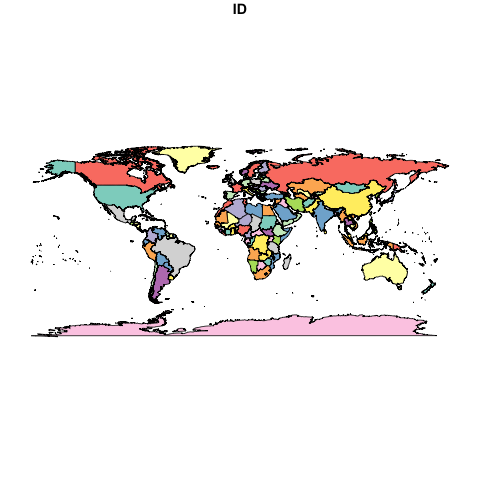

```{r setup, include=FALSE}
knitr::opts_chunk$set(echo = TRUE)
```

# Objet

Présenter un premier script et l'intégration d'une image (carte)

# Librairies

```{r}
library(sf)
library(mapsf)
```

# Données

```{r}
library(sf)
world <- st_as_sf(maps::map("world", plot = FALSE, fill = TRUE))
```

commune et carreau

```{r}
```

# Cartograhie

```{r}
png("carte.png")
plot(world["ID"])
dev.off()
```


